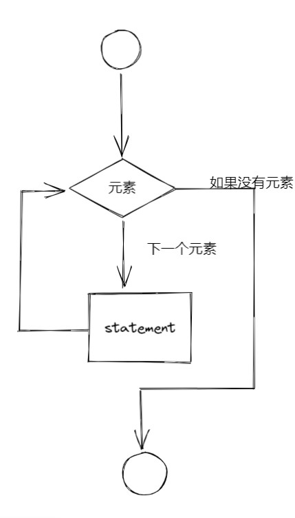

## for循环

for循环是让计算机自动完成重复工作方式之一

```python
magicians = ['alice','david','charon']
for magician in magicians:#不要遗漏逗号
    print(magician)#不要忘记缩进
    print(f"{magician.title()},is great.\n")
```

定义了一个for循环，从magicians中取出一个元素，并将其存储在变量magician中


在循环中我们可以完成很多操作，每个缩进的代码行都是循环的一部分，且将针对列表中的每个值都执行一次。因此，可对列表中的每个值执行任意次数的操作

在for循环后面，没有缩进的代码都只执行一次，而不会重复执行
```python
magicians = ['alice','david','charon']
for magician in magicians:#不要遗漏逗号
    print(magician)#不要忘记缩进
    print(f"{magician.title()},is great.\n")
print("thank you")
```

### range函数

```python
for value in range(1,5):
    print(value)
```
函数range()让你能够轻松地生成一系列的数字列表,且遵循左闭右开的原则。

要将这些数字转换为一个列表，可使用list()
```python
numbers = list(range(1,6))
print(numbers)

numbers = list(range(1,10,2))
print(numbers)
```
函数range()后面第三个参数为步长，函数range()从1开始数，然后不断地加2，直到达到或超过终值（10）

函数range()几乎能够创建任何需要的数字集
```python
squares = [value**2 for value in range(1,11)]
print(squares)
```

函数range()还可以和字符串连用
```python
name = 'charon'
for letter in name:
    print(letter)

print(len(name))

for i in range(len(name)):
    print(name[i])
```

### 使用列表

**切片**是处理列表的部分元素
要创建切片，可指定要使用的第一个元素和最后一个元素的索引

```python
list = ['','','','','','']
print(list[0:3])
```
负数索引返回离列表末尾相应距离的元素

**遍历切片**

```python
players = ['zhou','xue','zhang','hua']
for player in players[0:3]:
    print(player.title())
```


## while循环

```python
count = 0

while count <= 5:
    print(count)
    count += 1
```

让我们解释一下这个循环：
第一步，将0赋予变量count，然后创建了一个循环，并且设置了一个条件只要count<= 5就会进行循环，
然后打印变量count，然后再让count加1，继续执行。知道count不符合条件，循环停止。

### 标志

在要求很多条件都满足才继续运行的程序中，可定义一个变量，用于判断整个程序是否处于
活动状态。这个变量被称为标志，充当了程序的交通信号灯

```python
prompt = "\nTell me something, and I will repeat it back to you:"
prompt += "\nEnter 'quit' to end the program. "

active = True
while active:
    message = input(prompt)
    
    if message == 'quit':
        active = False
    else:
        print(message)
```

首先我们设置了一个变量active且值为true，接下来使用一个循环while后把active设置成标志，只要当我们输入quit时，标志active的值就会变为false。从而停止循环，否则循环将一直运行下去

### break&continue

 **当想退出或停止循环时，使用break语句**
 
```python
prompt = "\nTell me something, and I will repeat it back to you:"
prompt += "\nEnter 'quit' to end the program. "

while True:
    message = input(prompt)
    
    if message == 'quit':
        break
    else:
        print(message)
```

通过continue语句，可以根据条件测试来决定循环是否继续运行

```python
count = 0
while count < 5:
    if count == 3:
        count = count +  1
        continue

    print(count)

```


